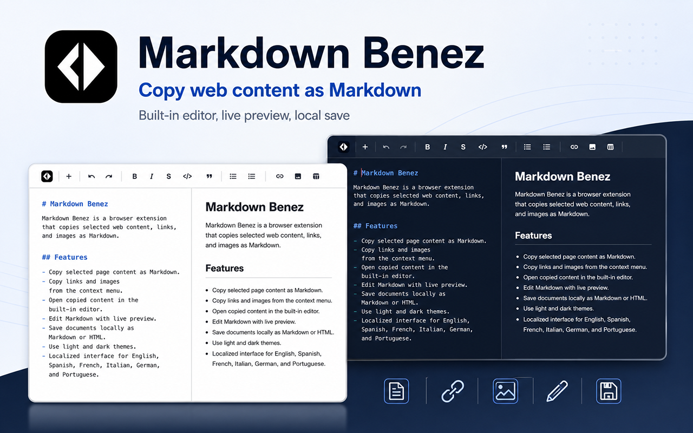

<div align="center">
  

  # Editor Markdown Online

  **Copy web content as Markdown and refine it in a clean, built-in editor.**

  [](source/manifest.json)
  [](LICENSE)
  [](PRIVACY.md)

  
  
  
  
  
  
</div>

---

Editor Markdown Online is a browser extension for turning selected content, links, and images from any web page into reusable Markdown. Copy the generated Markdown directly to your clipboard, or send it to the integrated editor to adjust formatting, preview the result, and save a document.

<div align="center">
  
</div>

## Features

- Copy a text selection, link, or image as Markdown from the browser context menu.
- Edit captured Markdown in a split-view editor with live preview.
- Create a new Markdown document by clicking the extension icon.
- Format headings, emphasis, lists, tasks, quotes, links, images, code, and tables from the toolbar.
- Export content as Markdown or HTML and keep local drafts in the browser.
- Switch between light and dark themes with the preference persisted locally.
- Use the interface in English, Spanish, French, Italian, German, or Portuguese according to the browser locale.

## Localized Name

| Language | Extension name |
| --- | --- |
| English | Markdown Online Editor |
| Spanish | Editor Markdown Online |
| French | Éditeur Markdown Online |
| Italian | Editor Markdown Online |
| German | Markdown Online-Editor |
| Portuguese | Editor Markdown Online |

## Permissions

| Permission | Purpose |
| --- | --- |
| `contextMenus` | Adds the copy and edit actions to the browser context menu. |
| `activeTab` | Accesses selected content in the active page only when the user triggers an action. |
| `storage` | Stores temporary editor drafts and preferences such as the chosen theme. |

The extension does not send copied content, documents, or browsing data to an external server. See the full [Privacy Policy](PRIVACY.md).

## Install Locally

```sh
git clone https://github.com/workhard-digital/markdown-benez.git
cd markdown-benez
npm install
npm run build
```

Then open `chrome://extensions`, enable **Developer mode**, choose **Load unpacked**, and select the `distribution/` directory.

## Build For Distribution

The production build minifies the extension JavaScript, editor JavaScript, CSS, HTML, manifest, and localization files into `distribution/`.

```sh
npm run build
cd distribution
zip -rFS ../editor-markdown-online.zip . -x "*.DS_Store"
cd ..
```

Upload `editor-markdown-online.zip` to the Chrome Web Store developer dashboard after testing the unpacked build in Chrome.

## Development

| Command | Purpose |
| --- | --- |
| `npm run build` | Creates the minified production extension in `distribution/`. |
| `npm run watch` | Rebuilds the extension while developing. |
| `npm run lint` | Runs the JavaScript lint checks. |
| `npm test` | Runs lint checks followed by the production build. |

## License

Released under the [MIT License](LICENSE).
